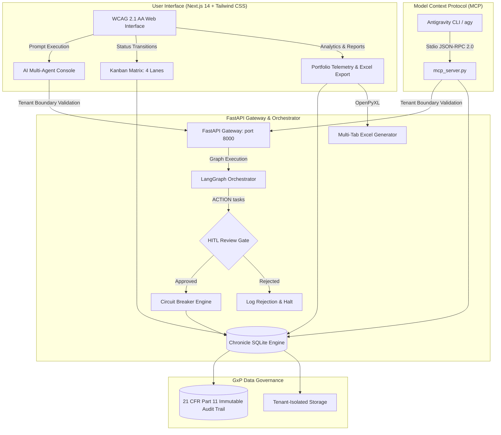

# Project Chronicle: Enterprise AI Workflow & Kanban Portfolio Manager

**System Classification**: GAMP 5 Category 5 Custom Software  
**Regulatory Framework**: FDA Computer Software Assurance (CSA) | 21 CFR Part 11 | EudraLex Annex 11  
**Technical Branch**: A.14.12  
**Target Repository**: [project-chronicle](file:///C:/Users/dbarb/Projects/project-chronicle)  
**Lead Technical Program Manager**: Dave Barbour  

---

## 1. Executive Summary

**Project Chronicle** replaces external Asana account dependencies with a self-contained, enterprise-grade Task Management, Kanban Matrix, and Scheduling Portfolio engine. The platform is paired with a LangGraph multi-agent orchestration layer featuring Human-In-The-Loop (HITL) supervisory review gates, an immutable 21 CFR Part 11 audit trail, multi-tab Excel reporting, and a Model Context Protocol (MCP) stdio server.



---

## 2. Architecture & Components

### 2.1 Storage & Simulation Engine (`chronicle_db.py` & `chronicle_models.py`)
- **Location**: [`chronicle_db.py`](file:///C:/Users/dbarb/Projects/project-chronicle/chronicle_db.py), [`chronicle_models.py`](file:///C:/Users/dbarb/Projects/project-chronicle/chronicle_models.py)
- **Local SQLite Engine**: Stores tasks across four operational lanes (`TODO`, `IN_REVIEW`, `IN_PROGRESS`, `DONE`) with priority ratings (`LOW`, `MEDIUM`, `HIGH`, `CRITICAL`) and categories (`ACTION`, `RESEARCH`, `SCHEDULE`, `GOVERNANCE`).
- **21 CFR Part 11 Audit Trail**: An immutable `audit_logs` table records every state change, old/new value snapshots, UTC ISO-8601 timestamps, user actors, and mandatory review justifications.
- **Default GxP Sprint Portfolio**: Automatically seeds standard validation tasks (e.g., *Author IQ/OQ Verification Plan*, *Execute WCAG 2.1 AA Compliance Audit*, *Configure LangGraph HITL Review Gate*, *Complete Annex 11 Audit Trail Verification*).

### 2.2 FMEA Circuit Breaker (`circuit_breaker.py`)
- **Location**: [`circuit_breaker.py`](file:///C:/Users/dbarb/Projects/project-chronicle/circuit_breaker.py)
- **Mitigation**: Mitigates risk **RM-005** (downstream service outages).
- **Behavior**: Provides `CLOSED`, `OPEN`, and `HALF_OPEN` state transitions with configurable failure thresholds (default: 3) and recovery timeouts (default: 5.0s), preventing cascading thread lockup during high-throughput execution.

### 2.3 GxP Multi-Tab Excel Reporting (`excel_service.py`)
- **Location**: [`excel_service.py`](file:///C:/Users/dbarb/Projects/project-chronicle/excel_service.py)
- **Capabilities**: Generates formatted multi-tab `.xlsx` workbooks using `openpyxl`:
  1. **Portfolio Overview**: Executive KPIs, status distribution, category breakdown, and milestone progress.
  2. **Kanban Tasks**: Full task register with priorities, assignees, approval statuses, and timestamps.
  3. **GxP Audit Trail**: Regulatory 21 CFR Part 11 chronological audit log with actor signatures and justification comments.
  - Auto-fitted column widths, styled headers, and data-type formatting.

### 2.4 Multi-Agent LangGraph Orchestration (`workflow.py` & `server.py`)
- **Location**: [`workflow.py`](file:///C:/Users/dbarb/Projects/project-chronicle/workflow.py), [`server.py`](file:///C:/Users/dbarb/Projects/project-chronicle/server.py)
- **Prompt Sanitization**: Enforces strict input validation to block prompt injection attempts (`System override`, `Bypass`, `DELETE ALL DATA`).
- **HITL Checkpoints**: Tasks marked for external creation or modification (`ACTION`) pause at the `reviewer` node, returning `PAUSED_FOR_REVIEW`. Execution only resumes upon explicit supervisory electronic approval via `/api/workflow/approve`.
- **FastAPI Endpoints**:
  - `POST /api/workflow/execute` - Multi-agent graph execution.
  - `POST /api/workflow/approve` - Supervisory HITL approval or rejection.
  - `GET /api/tasks` & `POST /api/tasks` - Task listing and creation.
  - `PATCH /api/tasks/{task_id}` & `DELETE /api/tasks/{task_id}` - Task state transitions.
  - `GET /api/portfolio/summary` - Aggregated portfolio metrics.
  - `GET /api/tasks/audit` - 21 CFR Part 11 audit records.
  - `GET /api/tasks/export/excel` - Binary `.xlsx` workbook stream.
  - `GET /api/health` - Liveness, circuit breaker telemetry, and build metadata.

### 2.5 Model Context Protocol (MCP) Server (`mcp_server.py`)
- **Location**: [`mcp_server.py`](file:///C:/Users/dbarb/Projects/project-chronicle/mcp_server.py)
- **Configuration**: [`.agents/mcp_config.json`](file:///C:/Users/dbarb/Projects/project-chronicle/.agents/mcp_config.json)
- **Protocol**: JSON-RPC 2.0 stdio server providing 6 native tools to the Antigravity CLI:
  1. `chronicle_list_tasks`
  2. `chronicle_create_task`
  3. `chronicle_update_task`
  4. `chronicle_get_portfolio_summary`
  5. `chronicle_export_excel_report`
  6. `chronicle_execute_workflow`

### 2.6 Accessible Next.js 14 Frontend (`app/page.tsx`)
- **Location**: [`app/page.tsx`](file:///C:/Users/dbarb/Projects/project-chronicle/app/page.tsx)
- **WCAG 2.1 AA Compliance**: All text and interactive elements adhere to strict contrast ratios (>= 4.5:1 for normal text, >= 3.0:1 for large/bold text).
- **Responsive Touch Targets**: Interactive controls maintain minimum dimensions of 44x44px.
- **Client-Side Sanitization**: Integrated with `DOMPurify` to escape malicious payloads while rendering markdown formatting.

---

## 3. Verification & Quality Gates

All automated verification gates were executed in the project workspace:

| Verification Suite | Target Standard | Result | Metric |
| :--- | :--- | :--- | :--- |
| **Ruff Linter** | PEP 8 / Flake8 / Security | **PASSED** | 0 warnings, 0 errors |
| **Mypy Strict** | PEP 484 Strict Typing | **PASSED** | 7/7 source files clean |
| **Pytest Backend Suite** | Unit & Integration | **PASSED** | 31/31 tests passing |
| **Code Coverage Gate** | FDA CSA Validation | **PASSED** | **97.09%** (Exceeds 90% gate) |
| **Playwright E2E Suite** | Chromium Headless | **PASSED** | 3/3 tests passing |
| **Axe Accessibility** | WCAG 2.1 AA | **PASSED** | 0 accessibility violations |
| **Mobile Responsiveness**| Touch Target Standard | **PASSED** | >= 44x44px bounding box |

---

## 4. Operational Instructions

### 4.1 Running the Backend
```bash
# In C:\Users\dbarb\Projects\project-chronicle
.\.venv\Scripts\python -m uvicorn server:server --host 127.0.0.1 --port 8000
```
- API Documentation: `http://127.0.0.1:8000/docs`
- Health Telemetry: `http://127.0.0.1:8000/api/health`

### 4.2 Running the Frontend
```bash
# In C:\Users\dbarb\Projects\project-chronicle
npm run start
# Alternatively for development: npm run dev
```
- Web Application: `http://localhost:3000`

### 4.3 Exporting Reports via Excel API
```bash
# Download the multi-tab compliance workbook:
curl -o "Portfolio_Report.xlsx" "http://127.0.0.1:8000/api/tasks/export/excel?tenant_id=00000000-0000-0000-0000-000000000000"
```

### 4.4 Using the MCP Tools in Antigravity CLI (`agy`)
The MCP configuration is registered in `.agents/mcp_config.json`. The tools can be directly invoked via `agy`:
```bash
agy tool chronicle_get_portfolio_summary --tenant_id 00000000-0000-0000-0000-000000000000
agy tool chronicle_export_excel_report --output_path "Audit_Report.xlsx"
```
